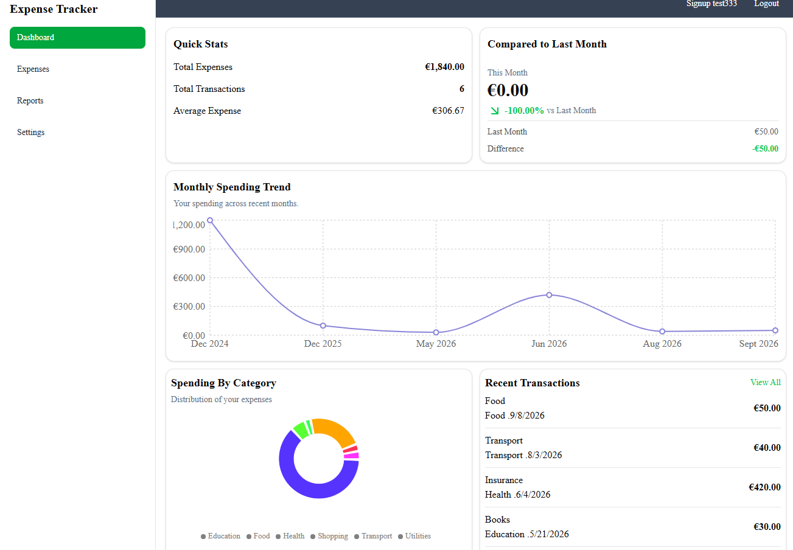
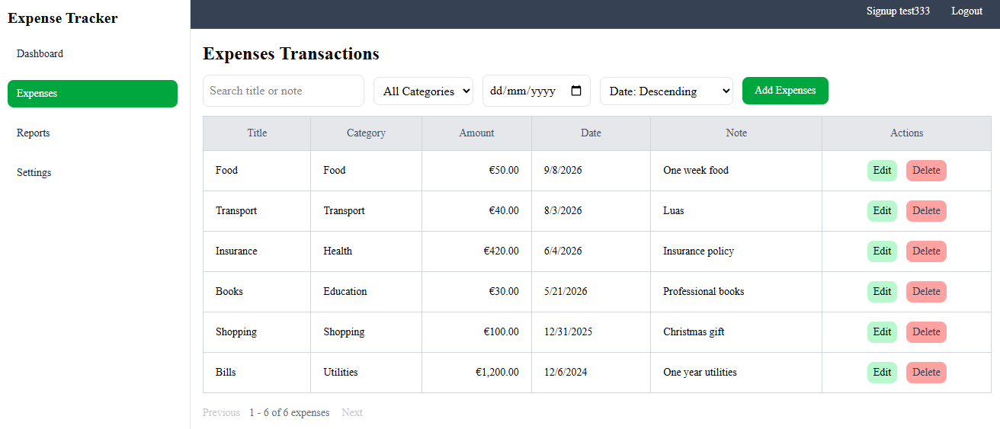
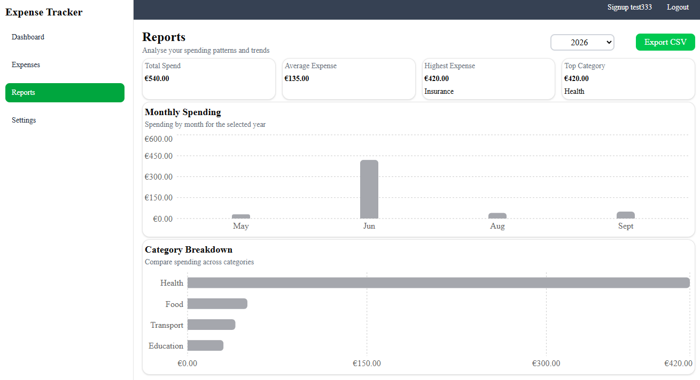
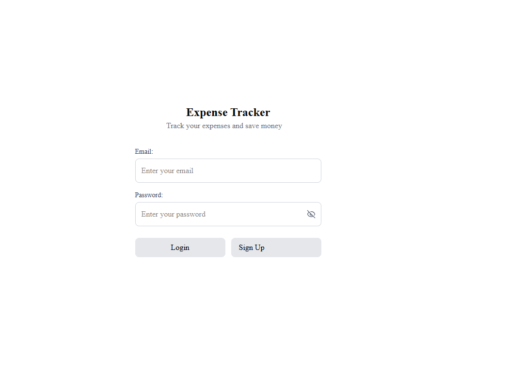
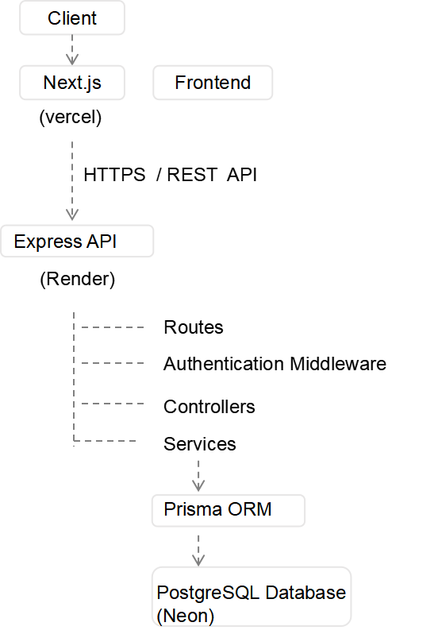
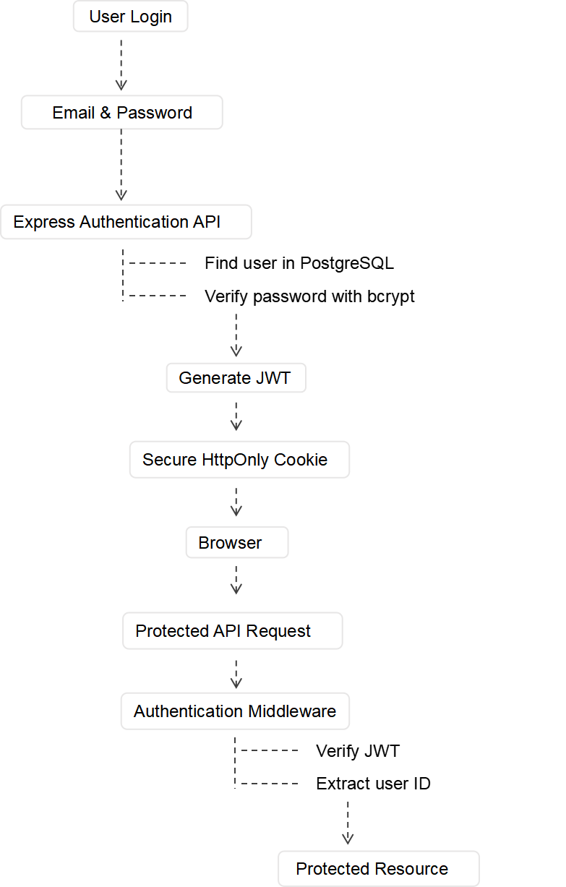
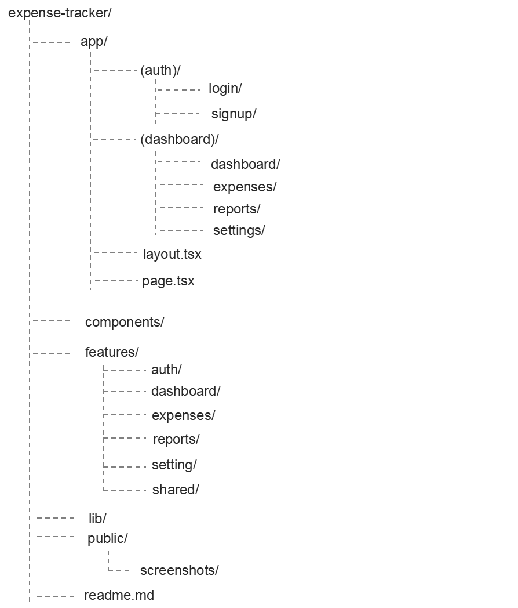

# Expense Tracker

A full-stack personal expense management application built with Next.js, TypeScript, Express, PostgreSQL, and Prisma.
Expense Tracker allows users to securely manage their expenses, analyze spending pattern, and generate yearly reports through a responsive dashboard.

## Live Demo

**Live Application:** https://expense-tracker-me-2740.vercel.app

## Application Preview

### Dashboard



### Expense Management



### Reports



### Authentication



## Features

### Authentication

- User registration and login

- JWT-based authentication using secure HtttpOnly cookies
- Persistent login sessions across page refreshes
- Protected dashboard routes
- Email availability validation during registration
- Secure logout and session handling

### Expense Management

- Create, view, edit, and delete personal expenses

- Search expenses by title or note
- Filter expenses by category and date
- Sort expense records

- Paginated expense table
- Form validation with React Hook Form and Zod
- User specific expense data protected by backend authorization

### Dashboard & Analytics

- Total spending, average expense, and transaction statistics

- Month-over-month spending comparison
- Spending trend visualization
- Category-based spending breakdown
- Recent transaction overview

### Reports

- Year-based expense reports

- Monthly spending analysis
- Category spending summaries
- Top spending category calculation
- CSV export

### User Preferences

- Currency preference

- Date format preference
- Preferences persisted between session

## Tech Stack

### Frontend

- Next.js 16

- React 19
- TypeScript
- Tailwind CSS
- shadcn/ui
- React Hook Form
- Zod
- Recharts

### Backend

- Node.js

- Express 5
- TypeScript
- Prisma ORM
- JWT (JSON Web Token)
- bcrypt
- Zod

### Database

- PostgreSQL
- Neon

### Deployment

- Vercel -- Frontend
- Render -- Backend API
- Neon -- PostgreSQL database

## Architecture

The application uses a separated frontend and backend architecture.



The frontend communicates with the Express backend through REST API requests.
The backend handles authentication, authorization, business logic, and database access.
Expense data is scoped to the authenticated user, preventing user from accessing or modifying expenses that belong to another account.

## Authentication Flow

Authentication is handled by the Express backend using JWT stored in secure httpOnly cookies.



The authentication system includes:

- Password hashing and verification with bcrypt

- JWT-based authentication
- Secure HttpOnly cookies for storing authentication tokens
- Protected API routes using authentication middleware
- Session restoration through the `/api/auth/me` endpoint
- User-specific authorization for expense operation
- secure logout by clearing the authentication cookie

## Project Structure



The frontend follows a feature-based structure. Authentication, expenses, dashboard analytics, reports, and setting are separated into their own feature modules to keep related components, hooks, services, schemas, types, and state management organized.

## Getting Started

### Prerequisites

Before running the project locally, make sure you have:

- Node.js
- npm
- A running instance of the Expense Tracker backend API

### Install

1. Clone the repository:

```bash
git clone https://github.com/xyypsy1234-dotcom/expense-tracker.git
```

2. Navigate to the project directory:

```bash
cd expense-tracker
```

3. Install dependencies:

```bash
npm install
```

4. Create a `.env.local` file in the project root:

```env
NEXT_PUBLIC_API_URL=http://localhost:5000
```

5. Start the development server:

```bash
npm run dev
```

6. Open the application in your browser:

```text
http://localhost:3000
```

## Environment Variables

The frontend requires the following environment variable:

```env
NEXT_PUBLIC_API_URL=http://localhost:5000
```

For production, this variable should point to the deployed backend API.
An example environment file is provided in:

```text
.env.example
```

## Backend Repository

The backend API is maintained in a separate repository:

**Backend:** https://github.com/xyypsy1234-dotcom/expense-tracker-api

The backend provides REST API endpoints for authentication and expense management, including user specific authorization and PostgreSQL persistence.

## Deployment

The application is deployed using separate frontend, backend, and database services:

**Frontend:** Vercel

**Backend API:** Render

**Database:** Neon PostgreSQL

The production frontend communicates with the backend over HTTPS. Cross origin requests are configured with credential support to allow HttpOnly cookie-based authentication between the frontend and backend.

## Future Improvements

Potential improvements for future versions include:

- Responsive optimization for smaller mobile devices
- Automated frontend and backend testing
- Password reset functionality
- Email verification
- Additional report filtering and analytics
- Docker-based development and deployment
- API health check endpoint
